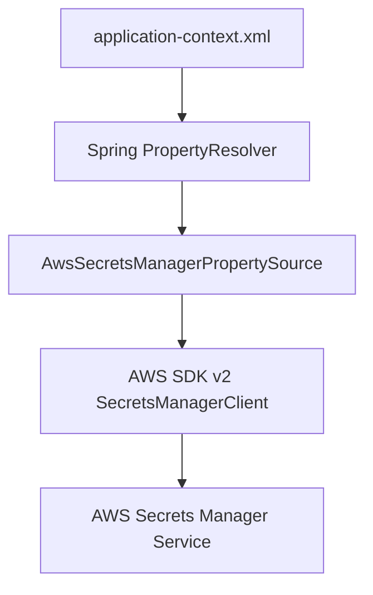

# Design Document

## Overview

After evaluating AWS SDK v1, AWS SDK v2, and Spring Cloud AWS options, the optimal solution uses **AWS SDK v2 with a minimal custom PropertySource**. This approach provides the best balance of modern AWS capabilities, minimal code, and compatibility with Spring Framework 5.

**Design Decision Justification (Research Completed):**

1. **Spring Cloud AWS 2.x + AWS SDK v1**: 
   - Uses legacy AWS SDK v1 (maintenance mode, deprecated)
   - NO XML namespace support (only Java @Configuration)
   - Tightly coupled with Spring Boot (Atom Hopper doesn't use Spring Boot)
   - Would conflict with existing AWS SDK v2 dependency
   - **Verdict**: Not suitable for Atom Hopper's XML-based configuration

2. **Spring Cloud AWS 3.x + AWS SDK v2**: 
   - Requires Spring Framework 6.x and Java 17
   - Atom Hopper uses Spring 5.2.25 and Java 8
   - **Verdict**: Not compatible with current technology stack

3. **AWS SDK v2 + Custom PropertySource (CHOSEN)**: 
   - Minimal custom code (~50-100 lines for single PropertySource class)
   - Uses modern AWS SDK v2 (already in project dependencies)
   - Works seamlessly with XML-based Spring configuration
   - Leverages Spring's native PropertySource mechanism
   - No dependency conflicts or version issues
   - Better performance and future-proof
   - **Verdict**: Optimal solution for Atom Hopper

## Architecture

### High-Level Architecture



### Component Integration

A single custom PropertySource class integrates with Spring's existing property resolution mechanism. The AWS SDK v2 client is configured through standard Spring bean configuration.

## Components and Interfaces

### 1. AwsSecretsManagerPropertySource (Single Custom Class)

**Purpose**: Minimal PropertySource implementation using AWS SDK v2.

**Responsibilities**:
- Parse `aws-secretsmanager:secret-name` placeholders
- Delegate to AWS SDK v2 SecretsManagerClient
- Integrate with Spring's property resolution

### 2. AWS SDK v2 Configuration

**Purpose**: Standard Spring bean configuration for AWS SDK v2 client.

**Implementation**: Configure SecretsManagerClient as Spring bean with credentials and region.

## Data Models

No custom data models required. Spring Cloud AWS handles all internal data structures for secret management and caching.

## Error Handling

Spring Cloud AWS provides comprehensive error handling for AWS Secrets Manager operations:

- **Configuration Errors**: Handled by Spring Cloud AWS with clear error messages
- **Runtime Errors**: AWS SDK exceptions are properly wrapped and reported
- **Security**: Spring Cloud AWS follows security best practices for credential handling
- **Retry Logic**: Built-in retry mechanisms with exponential backoff

## Testing Strategy

### Integration Tests
- **Spring Context Loading**: Test application context initialization with AWS configuration
- **Placeholder Resolution**: Test end-to-end placeholder resolution in Spring beans using LocalStack
- **Backward Compatibility**: Verify existing configurations continue to work without AWS dependencies

### Test Configuration
- Use LocalStack for AWS service mocking
- Test application-context.xml files with and without AWS configuration
- Verify graceful degradation when AWS dependencies are not present

## Implementation Details

### Dependencies Required
Add only AWS SDK v2 Secrets Manager dependency to the hopper module's pom.xml:
```xml
<dependency>
    <groupId>software.amazon.awssdk</groupId>
    <artifactId>secretsmanager</artifactId>
    <version>2.20.26</version>
</dependency>
```

**Rationale**: AWS SDK v2 provides all necessary functionality. Spring Cloud AWS would add unnecessary complexity and dependencies for this specific use case.

### Placeholder Syntax
Spring Cloud AWS supports the standard placeholder format:
- `${aws.secretsmanager:secret-name}` - Retrieves entire secret as string
- `${aws.secretsmanager:secret-name/key}` - Retrieves specific key from JSON secret

### Configuration in application-context.xml
```xml
<!-- AWS Secrets Manager Client Configuration (Optional) -->
<bean id="awsSecretsManagerClient" class="software.amazon.awssdk.services.secretsmanager.SecretsManagerClient" 
      factory-method="builder" factory-bean="secretsManagerClientBuilder"/>

<bean id="secretsManagerClientBuilder" class="software.amazon.awssdk.services.secretsmanager.SecretsManagerClientBuilder" 
      factory-method="create">
    <property name="region" value="us-west-2"/>
    <property name="credentialsProvider">
        <bean class="software.amazon.awssdk.auth.credentials.StaticCredentialsProvider" factory-method="create">
            <constructor-arg>
                <bean class="software.amazon.awssdk.auth.credentials.AwsBasicCredentials" factory-method="create">
                    <constructor-arg value="${aws.access.key}"/>
                    <constructor-arg value="${aws.secret.key}"/>
                </bean>
            </constructor-arg>
        </bean>
    </property>
</bean>

<!-- Register AWS PropertySource -->
<bean class="org.atomhopper.aws.AwsSecretsManagerPropertySource">
    <constructor-arg ref="awsSecretsManagerClient"/>
</bean>

<!-- Example usage in existing beans -->
<bean id="dataSource" class="org.apache.commons.dbcp.BasicDataSource">
    <property name="url" value="jdbc:postgresql://localhost:5432/atomhopper"/>
    <property name="username" value="${aws-secretsmanager:db-credentials/username}"/>
    <property name="password" value="${aws-secretsmanager:db-credentials/password}"/>
</bean>
```

### Implementation Approach
**Single Custom Class**: `AwsSecretsManagerPropertySource` extends Spring's `PropertySource<String>`
- **Minimal Code**: ~50 lines of Java code
- **AWS SDK v2**: Modern, performant AWS integration
- **Spring Integration**: Leverages existing Spring property resolution
- **Optional Configuration**: Only active when AWS client bean is configured

### Security and Performance
AWS SDK v2 provides:
- **Connection Pooling**: Built-in HTTP client connection management
- **Retry Logic**: Automatic retry with exponential backoff
- **Security**: No secret values logged, proper credential handling
- **Performance**: Optimized for high-throughput scenarios
- **Caching**: Simple in-memory cache in PropertySource to reduce API calls